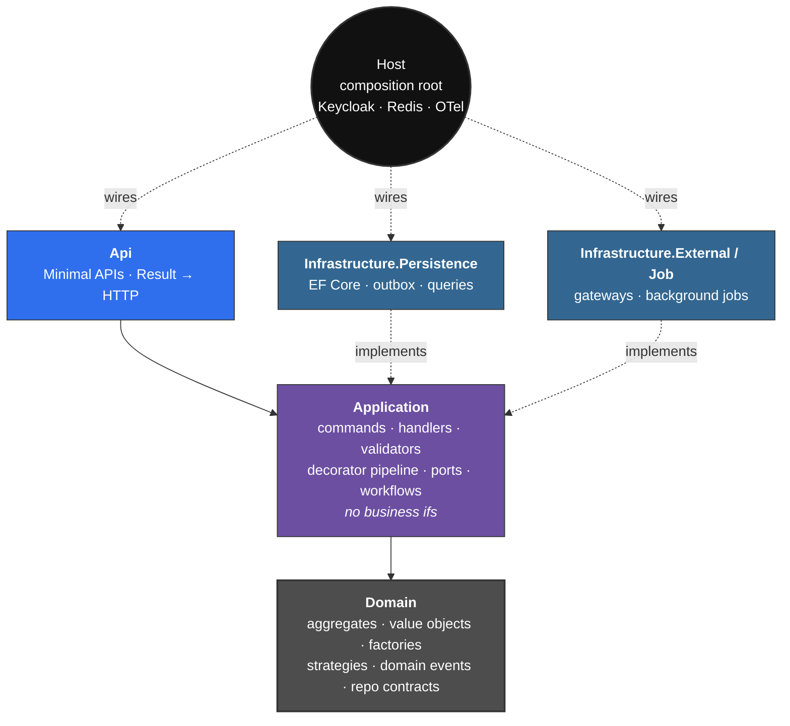
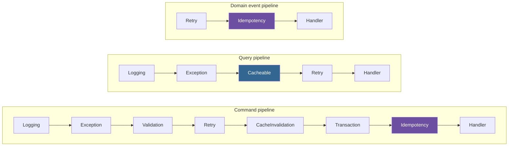
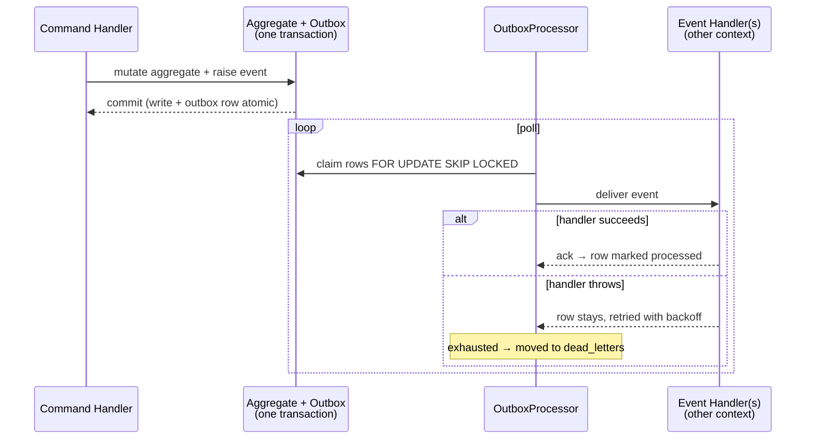
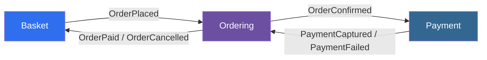
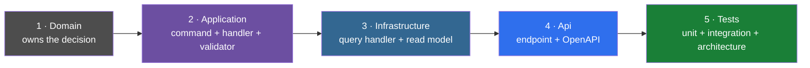
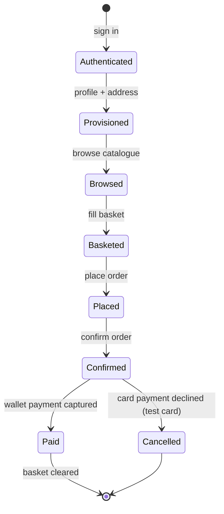

<div align="center">

# Tnosc.EShop

**A reference eShop backend built the long way round.**
Clean Architecture · DDD · CQRS - on a small in-repo framework, not MediatR/FluentValidation/AutoMapper.

[](#installation)
[](#installation)
[](#usage)
[](#license)

</div>

Five bounded contexts - **Catalog**, **Identity**, **Basket**, **Ordering**, **Payment** - talk to
each other only through domain events carried by a transactional outbox, and every architectural rule
here is enforced by a test rather than by a code review.

It is a teaching codebase as much as a working one. The interesting parts are the ones that are
usually hand-waved: the outbox and its inbox, the decorator pipeline, the read/write context split,
where a business rule is allowed to live, and how a permission gets from a Keycloak realm role to an
endpoint.

| | |
|---|---|
| 📐 Design rules | [`CLAUDE.md`](./CLAUDE.md) |
| 📏 Narrow policies | [`.claude/rules/`](./.claude/rules) |
| 🧭 Design decisions | [`docs/decisions/`](./docs/decisions) |

### The architecture in a paragraph

Dependencies point inwards, always. **Domain** owns every business decision and knows about nothing
else - no EF Core, no ASP.NET, not even `Microsoft.Extensions.*`. **Application** orchestrates: it
loads an aggregate, delegates the decision to it, and commits; it is not allowed to contain a business
`if`, and a Roslyn scanner in the architecture suite enforces that. **Infrastructure** is dumb and
policy-free - persistence, EF configuration, external gateways, and the *query* side of CQRS, which
lives here on purpose because a projection is a technical concern. **Api** is Minimal APIs that turn a
`Result` into HTTP and nothing more. Bounded contexts are folders, not assemblies, and they never
reference each other: context B reacts to context A's domain event in B's own `EventHandlers/` folder,
against B's own types.



### The decorator pipeline

Cross-cutting concerns (logging, exceptions, validation, retry, caching, transactions, idempotency)
are never written into a handler - they wrap it. Each is a nested `IHandlerDecorator` in
`Tnosc.Lib.Application`, applied with Scrutor's `TryDecorate` in outermost-to-innermost order, and
composed differently for each of the three flows:



Two placements are load-bearing, not incidental:

- **`Idempotency` is innermost on every pipeline that has it**, so the key is claimed in the same
  database transaction as the handler's own writes - see
  [`.claude/rules/idempotency.md`](./.claude/rules/idempotency.md).
- **`Retry` sits outside `Idempotency`**, so each attempt gets its own transaction rather than
  retrying inside one Postgres has already aborted.

Opt-in decorators (`Cacheable`/`CacheTag`, `Idempotent`, `Retry`) are attributes on the handler class,
read through `HandlerMetadata`, which unwraps the whole chain rather than inspecting the outermost
decorator directly. See [ADR-009](./docs/decisions/ADR-009-Cross-Cutting-Concerns-Via-Decorators.md)
for why this replaced a mediator pipeline, and
[ADR-001](./docs/decisions/ADR-001-No-Mediator-Library-Custom-CQRS-Pipeline.md) for the CQRS split
that shapes it.

Two things worth knowing before reading any code:

- **One database, one schema per context** (`catalog`, `identity`, `ordering`, `payment`, plus
  `outbox` and `idempotency`) - because an aggregate's write and its outbox row must share a
  transaction, which means sharing a `DbContext`. Basket is the exception: it is a TTL'd JSON document
  in Redis, with no schema, no EF configuration and no migration.
- **Delivery is at-least-once, and the inbox closes the window.** `[Idempotent]` on a handler claims
  its key - the caller's `Idempotency-Key` for a command, `IDomainEvent.Id` for an event - in the
  *same transaction* as the handler's own writes. See
  [`.claude/rules/idempotency.md`](./.claude/rules/idempotency.md).



Each bounded context reacts to another's event in its **own** `EventHandlers/` folder, never by
referencing the other context's types:



---

## Table of contents

- [Installation](#installation)
- [Usage](#usage)
  - [Get a token and call the API](#get-a-token-and-call-the-api)
  - [Project layout](#project-layout)
  - [How to add a feature slice](#how-to-add-a-feature-slice)
  - [How to add a migration](#how-to-add-a-migration)
  - [Build](#build)
- [Tests](#tests)
- [Roadmap](#roadmap)
- [Credits](#credits)
- [License](#license)
- [Contributing](#contributing)

---

## Installation

### Prerequisites

| | |
|---|---|
| .NET SDK | **10.0.400-preview** or later. There is no `global.json`, so the SDK floats with what is installed. |
| Docker | Required. Postgres, Redis and Keycloak all run as containers, and the integration and acceptance suites need it too. |
| Free ports | **8080** for Keycloak - the AppHost pins it so the admin console lives at a stable address. If it is taken, the Keycloak container silently never starts. |

### Run it

```bash
dotnet run --project aspire/Tnosc.EShop.AppHost
```

That brings up Postgres (+ pgAdmin), Redis (+ RedisInsight), Keycloak with the `eshop` realm imported,
and the API. In Development the API applies its migrations on startup and seeds a sample catalogue, so
the first thing you see is a working, populated API. The Aspire dashboard link is printed in the
console; Scalar's interactive API reference is at **`/scalar`** on the API's address, and the OpenAPI
document at `/openapi/v1.json`. Both are Development-only.

The API alone, against a Postgres you supply:

```bash
ConnectionStrings__eshopdb="Host=localhost;Port=5432;Database=eshopdb;Username=postgres;Password=..." \
  dotnet run --project src/server/Tnosc.EShop.Server.Host
```

Postgres and Redis both use `WithDataVolume()`, so data survives restarts - which also means a schema
or document-shape change during development may need the volume dropped before the next run agrees
with you. The same is true of the realm: `--import-realm` is a no-op once the realm exists, so editing
`aspire/Tnosc.EShop.AppHost/Realms/eshop-realm.json` changes nothing until the realm is deleted or the
volume is dropped.

---

## Usage

### Get a token and call the API

Keycloak owns sign-up, login and passwords; this API has no registration endpoint and no dev
token-issuing endpoint. The realm ships two users, both with the password `Passw0rd!`:

| User | Realm role | Gets |
|---|---|---|
| `customer@eshop.local` | `customer` | `catalog:read`, plus every `me` route |
| `admin@eshop.local` | `admin` | catalogue writes, customer administration, payments, shipping |

The `eshop-web` client is public with direct access grants enabled, so a password grant over `curl`
is the quickest way in:

```bash
API=https://localhost:7257          # the address the Aspire dashboard shows for eshop-host

TOKEN=$(curl -s -X POST http://localhost:8080/realms/eshop/protocol/openid-connect/token \
  -d grant_type=password -d client_id=eshop-web \
  -d username=customer@eshop.local -d password='Passw0rd!' \
  | jq -r .access_token)

# anonymous - storefront reads are public on purpose
curl $API/api/catalog/products

# authenticated
curl -H "Authorization: Bearer $TOKEN" $API/api/identity/customers/me

# a write whose handler is [Idempotent] needs a key, or it is a 400
curl -X POST $API/api/orders \
  -H "Authorization: Bearer $TOKEN" -H "Idempotency-Key: $(uuidgen)"
```

**Use the HTTPS address for anything authenticated.** The API calls `UseHttpsRedirection()`, and both
`curl` and `HttpClient` drop the `Authorization` header when they follow a redirect that changes
scheme - so an authenticated call to the plain-HTTP address arrives anonymous and comes back 401 with
a bare `WWW-Authenticate: Bearer`, which reads like a bad token and is not one.

Or click **Authorize** in Scalar, which is pre-wired to the same client with PKCE.

Roles live in Keycloak; permissions live in code. An endpoint names
`Permissions.Catalog.Write`, never a role, and `KeycloakClaimsTransformation` expands a realm role
into permission claims. Adding a permission is a constant, not a realm change - see
[`.claude/rules/authorization.md`](./.claude/rules/authorization.md).

### Project layout

| Project | What it is for |
|---|---|
| `lib/Tnosc.Lib.Domain` | `Entity`, `AggregateRoot`, `ValueObject`, strongly-typed ids, `Result`/`Error`, `IRepository`, `IDomainEvent` |
| `lib/Tnosc.Lib.Application` | `ICommandHandler`/`IQueryHandler`, `IValidator`, `IUnitOfWork`, the decorator pipeline and its attributes |
| `lib/Tnosc.Lib.Api` | `IApiEndpoint`, `CustomResults`, the `Result` → HTTP mapping |
| `lib/Tnosc.Lib.Infrastructure.Persistence` | Read/write `DbContext` bases, `UnitOfWork`, `RepositoryBase`, outbox, inbox, dead letters, EF conventions, migration hosted service |
| `lib/Tnosc.Lib.Host` | `HttpUserContext`, global exception handler, `RequestContextMiddleware`, permission authorization |
| `src/server/…Server.Domain` | The five contexts' aggregates, value objects, factories, strategies, domain events, repository contracts |
| `src/server/…Server.Application` | Commands, handlers, validators, DTOs, workflows, step services, ports, domain-event handlers |
| `src/server/…Server.Infrastructure.Persistence` | EF configurations, repositories, query handlers, read models, migrations, the Development seeder |
| `src/server/…Server.Infrastructure.External` | Things outside the process: the Redis basket store, the fake payment gateway |
| `src/server/…Server.Infrastructure.Job` | Background jobs |
| `src/server/…Server.Api` | Minimal-API endpoints and their request contracts, one folder per feature |
| `src/server/…Server.Shared` | The permission vocabulary, role → permission map, cache-tag constants - the things two projects that cannot see each other must agree on |
| `src/server/…Server.Host` | Composition root: authentication, OpenAPI, Redis, the pipeline order |
| `aspire/…AppHost` | Postgres, pgAdmin, Redis, RedisInsight, Keycloak + realm import, the API |
| `aspire/…ServiceDefaults` | OpenTelemetry, health checks, service discovery, resilience |

### How to add a feature slice

A slice is vertical, and the order is fixed. Catalog is the reference implementation - copy its
shapes, then:



1. **Domain** - does an aggregate already own this decision? If the rule spans more than one instance
   (uniqueness, for example) it belongs in a factory that can reach the repository, never in a handler.
2. **Application** - `<Feature>Command` + `<Feature>CommandHandler` (sealed) + validator, in
   `Server.Application/<Context>/Commands/<Feature>/`. The handler loads, guards, delegates, commits,
   and returns the domain's verdict unreinterpreted.
3. **Infrastructure** - a query handler in `Server.Infrastructure.Persistence/<Context>/Queries/` over
   `EShopReadDbContext`, projecting a read model into the Application DTO. Raw SQL is for multi-table
   joins, parameterized, with `Guid` rather than typed ids.
4. **Api** - `internal sealed class <Feature>Endpoint : IApiEndpoint`, injecting the *closed* handler
   interface. Route templates come from the context's `*Routes` constants; describe it for OpenAPI with
   `.WithName`, `.WithTags`, `.WithSummary`, `.WithDescription` and the `.Produces<T>(…)` set it can
   actually return.
5. **Tests** - a unit test per domain rule and per handler, an integration test per query handler
   against real Postgres, and an architecture test if the slice introduced a new rule.

Each layer has its own `CLAUDE.md` with the rules for that tree, and
[`.claude/rules/`](./.claude/rules) holds the policies that span layers: cache tags, idempotency,
domain events, migrations, configuration options, authorization, analyzer suppressions, dependencies,
code style.

Catalog is the reference implementation. Copy its slice layout.

### How to add a migration

```bash
dotnet ef migrations add <Name> --context EShopWriteDbContext \
  --project src/server/Tnosc.EShop.Server.Infrastructure.Persistence \
  --startup-project src/server/Tnosc.EShop.Server.Host
```

**`--context` is not optional.** Two `DbContext`s exist - `EShopWriteDbContext` and
`EShopReadDbContext` - and `dotnet ef` refuses to guess between them. Only the write context has
migrations; the read context maps read models over the same tables and never writes, so a migration
generated against it would be meaningless.

`dotnet ef` runs outside Aspire, so it takes its connection string from `EShopWriteDbContextFactory`
(env `ConnectionStrings__eshopdb`, falling back to a local default). Names are
`PascalCase_With_Underscores`.

**Then read the file it generated**, before trusting it: the schema must be created before its tables,
no `DropColumn`/`RenameColumn` should appear that you did not ask for (EF infers a rename as
drop-plus-add, which discards the data), and no other context's objects should be in there. Full
checklist in [`.claude/rules/migrations.md`](./.claude/rules/migrations.md).

### Build

```bash
dotnet build Tnosc.EShop.slnx
```

`TreatWarningsAsErrors`, `CodeAnalysisTreatWarningsAsErrors`, `AnalysisMode=All`, four analyzer
packages, `Nullable=enable` and `ImplicitUsings=disable` apply to every project, and all five `lib/`
projects generate documentation files - so a missing XML doc there is a build error. Central Package
Management is on: never put `Version=` on a `PackageReference`; add a `<PackageVersion>` to
`Directory.Packages.props` and reference the package bare.

A change is done when the build is clean, the new tests are green, and the architecture suite still
passes.

---

## Tests

Four suites, and the split is a rule rather than a habit: domain and command logic are isolated and
fast; anything involving a query, a projection or the outbox runs against a real database.

| Suite | Covers | Tools | Needs Docker |
|---|---|---|---|
| `Tests.Unit` | Domain factories, entities, value objects, strategies, invariants; command handlers; `lib/` units | xUnit, NSubstitute, Shouldly, Bogus | no |
| `Tests.Integration` | Query handlers, EF projections, `UnitOfWork`, outbox processor, idempotency, auditing | Testcontainers Postgres + Redis, Respawn | yes |
| `Tests.Architecture` | Layer dependencies, context isolation, naming, the no-business-branching Roslyn scan, no injected `IConfiguration` | NetArchTest, Roslyn, Mono.Cecil | no |
| `Tests.Acceptance` | The customer journey end to end over HTTP against the booted app | `Aspire.Hosting.Testing` | yes |

```bash
dotnet test Tnosc.EShop.slnx                                    # all four
dotnet test tests/server/Tnosc.EShop.Server.Tests.Unit
dotnet test tests/server/Tnosc.EShop.Server.Tests.Architecture
dotnet test tests/server/Tnosc.EShop.Server.Tests.Integration   # Docker
dotnet test tests/server/Tnosc.EShop.Server.Tests.Acceptance    # Docker + port 8080 free

dotnet test tests/server/Tnosc.EShop.Server.Tests.Unit --filter "FullyQualifiedName~ProductTests"
```

The acceptance suite boots the whole AppHost once and drives two journeys over HTTP:



- **Paid:** authenticate → provision profile and address → browse the catalogue → fill a basket →
  place an order → confirm it → the outbox opens a wallet payment, captures it, and the order reaches
  `Paid` - with the basket cleared along the way by the same event.
- **Cancelled:** the same up to the order, then a card payment with the gateway's always-declining
  test card, whose failure event cancels the order.

Because the outbox is asynchronous, every assertion past `POST /api/orders` polls with a timeout rather
than sleeping a fixed interval. Two things the suite needs, both documented in `AppHostFixture`: the
development certificate trusted (`dotnet dev-certs https --trust`), and host port 8080 free - so don't
run it while `dotnet run --project aspire/Tnosc.EShop.AppHost` is up, since it shares that port and
that data volume.

An architecture test failure is a design error, not a test to relax.

---

## Roadmap

The API and its test suites are the deliverable so far. Two things are next:

- **A Blazor client, on Fluent UI v5** (`Microsoft.FluentUI.AspNetCore.Components`) - `src/client/web/`
  is currently an empty solution folder reserved for it. It will consume the existing OpenAPI contract
  rather than change it.
- **AI integration via the Microsoft Agent Framework** - an agent over the Catalog/Ordering read side
  (e.g. product search, order status) as a new bounded-context-style slice, following the same
  Domain/Application/Infrastructure/Api layering and decorator pipeline as everything else here rather
  than bypassing it.

Neither has landed yet; this section states the intent, not a shipped seam.

---

## Credits

Tnosc.EShop is written and maintained by **Ahmed HEDFI** (ahmed.hedfi@gmail.com), for the
**Tunisian .NET Open Source Community (TNOSC)**.

## License

Provided by TNOSC and freely available under the **MIT License**, per the header carried in every
source file in this repository.

## Contributing

This repo enforces its architecture with tests, not code review, so start with the rules rather than
the code:

- [`CLAUDE.md`](./CLAUDE.md) and its scoped per-project files for the conventions of the tree you're
  editing.
- [`.claude/rules/`](./.claude/rules) for narrow, cross-cutting policies (cache tags, idempotency,
  domain events, migrations, configuration options, authorization, dependencies, code style).
- [`docs/decisions/`](./docs/decisions) for the reasoning behind decisions already made, before
  proposing to reverse one.

A change is done when `dotnet build Tnosc.EShop.slnx` is clean, the new unit and integration tests
are green, and the architecture suite still passes.

This repo also leans on the **Claude Code harness** for day-to-day development: scoped `CLAUDE.md`
files and [`.claude/rules/`](./.claude/rules) are read automatically by the agent, and
[`.claude/agents/`](./.claude/agents) and [`.claude/skills/`](./.claude/skills) encode repeatable
workflows (scaffolding a slice, backfilling tests, an architecture audit) as first-class tools rather
than ad hoc prompts. Contributions using Claude Code should go through those rather than freehand.
